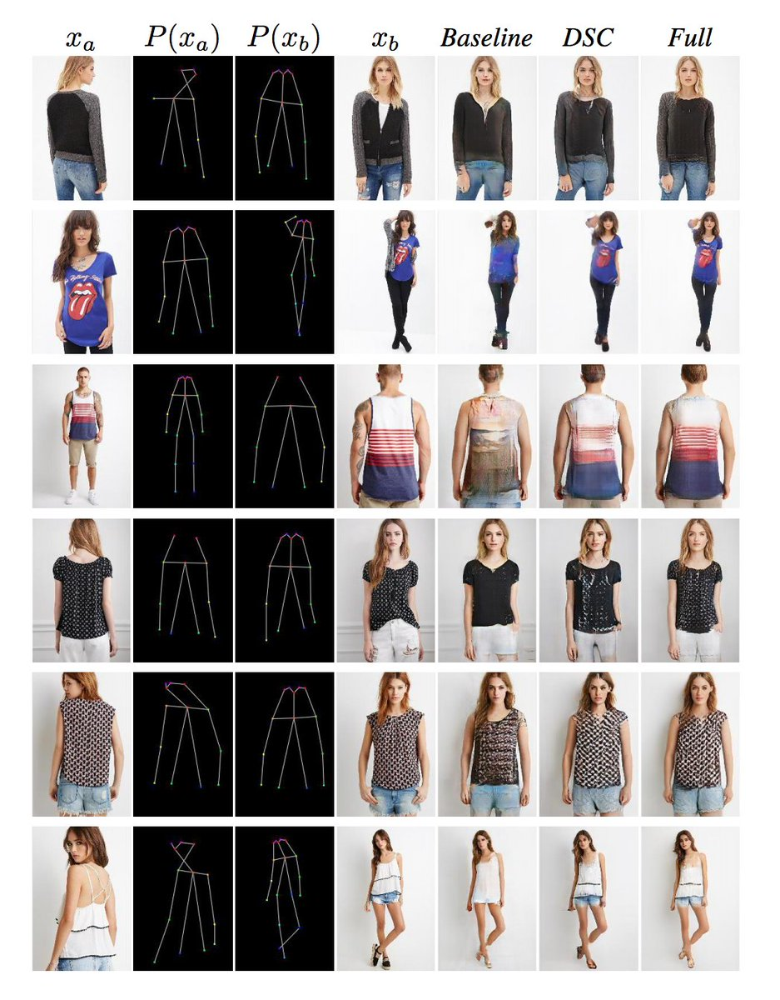

# Deformable GANs for Pose-based Human Image Generation.
[Check out our paper](https://arxiv.org/abs/1801.00055)

This is keras+tensorflow implimentation. Check out pytorch [implimentation](https://github.com/ssfootball04/pose-transfer) by ssfootball04.



### Requirment
* python2
* Numpy
* Scipy
* Skimage
* Pandas
* Tensorflow
* Keras
* Keras-contrib
* tqdm 

### Clone repository
```git clone --recursive https://github.com/AliaksandrSiarohin/pose-gan/``` (It is important to clone it like this, code not work with master branch of gan submodule).

### Training
In orger to train a model:
1. Download market dataset https://drive.google.com/file/d/0B8-rUzbwVRk0c054eEozWG9COHM/view. Put it in data folder. Rename this folder to data/market-dataset. Rename bounding_box_test and bounding_box_train with test and train. 


1.1 Download deep [fasion dataset in-shop clothes retrival benchmark](http://mmlab.ie.cuhk.edu.hk/projects/DeepFashion/InShopRetrieval.html). You will need to ask a pasword from dataset maintainers. Move img/ to data folder and rename it fasion/. Download key-point estimations from (https://yadi.sk/d/suymftBy3S7oKD) for fasion. Run script ```split_fasion_data.py``` in data/ folder. Go to the step 3. 

2. Download pose estimator (conversion of this https://github.com/ZheC/Realtime_Multi-Person_Pose_Estimation) [pose_estimator.h5](https://yadi.sk/d/blgmGpDi3PjXvK). Launch ```python compute_cordinates.py.``` It will compute human keypoints. Alternativlly you can download key points estimations from (https://yadi.sk/d/suymftBy3S7oKD).
3. Create pairs dataset with ```python create_pairs_dataset.py```. It define pairs for training.
4. Run ```python train.py``` (see list of parameters in cmd.py)
To replicate the experiment in the paper use following setup:
#### Market
##### baseline
```CUDA_VISIBLE_DEVICES=0 python train.py --output_dir output/baseline --checkpoints_dir output/baseline --warp_skip none --dataset market --l1_penalty_weight 100 --batch_size 4 --number_of_epochs 90```
##### dsc
```CUDA_VISIBLE_DEVICES=0 python train.py --output_dir output/dsc --checkpoints_dir output/dsc --warp_skip mask --dataset market --l1_penalty_weight 100 --batch_size 4 --number_of_epochs 90```
##### full
```CUDA_VISIBLE_DEVICES=0 python train.py --output_dir output/full --checkpoints_dir output/full --warp_skip mask --dataset market --l1_penalty_weight 0.01 --nn_loss_area_size 3 --batch_size 4 --content_loss_layer block1_conv2 --number_of_epochs 90```
##### feature matching
```CUDA_VISIBLE_DEVICES=0 python train.py --output_dir output/fm --checkpoints_dir output/fm --warp_skip mask --dataset market --l1_penalty_weight 0.5 --batch_size 4 --content_loss_layer block2_conv1 --number_of_epochs 90```

#### Fashion
##### baseline
```CUDA_VISIBLE_DEVICES=0 python train.py --output_dir output/baseline --checkpoints_dir output/baseline --warp_skip none --dataset fasion --l1_penalty_weight 100 --batch_size 4 --number_of_epochs 90```
##### dsc
```CUDA_VISIBLE_DEVICES=0 python train.py --output_dir output/dsc --checkpoints_dir output/dsc --warp_skip mask --dataset fasion --l1_penalty_weight 100 --batch_size 4 --number_of_epochs 90```
##### full
```CUDA_VISIBLE_DEVICES=0 python train.py --output_dir output/full --checkpoints_dir output/full --warp_skip mask --dataset fasion --l1_penalty_weight 0.01 --nn_loss_area_size 5 --batch_size 2 --content_loss_layer block1_conv2 --number_of_epochs 90```
##### feature matching
```CUDA_VISIBLE_DEVICES=0 python train.py --output_dir output/fm --checkpoints_dir output/fm --warp_skip mask --dataset fasion --l1_penalty_weight 0.5 --batch_size 4 --content_loss_layer block2_conv1 --number_of_epochs 90```

### Testing
0. Download checkpoints (https://yadi.sk/d/dxVvYxBw3QuUT9).
1. Run ```python test.py --generator_checkpoint path/to/generator/checkpoint``` (and same parameters as in train.py). It generate images and compute inception score, SSIM score and their masked versions.
2. To compute ssd_score. Download pretrained on VOC 300x300 model and install propper caffe version https://github.com/weiliu89/caffe/tree/ssd. Put it in the ssd_score forlder. Run ```python compute_ssd_score.py --input_dir path/to/generated/images --img_index 2```

#### Additional notes
Both training and testing require large amount of disk space, because ```compute_pose_map_batch``` in ```pose_dataset.py``` store intermediate pose_maps on disk. This help to improve both training and testing time. If you don't have enogh space comment lines 64,65,66 and 69 in ```pose_dataset.py```

Check sup-mat for additional data from paper: RE-ID experiment, user study images, names of the images from paper.

For deep-fashion there are 2 splits: old and new. Images from Fig. 5, 11, 13 is from the old split. Image in other figures, is from the new one. Scores in the tables is from new split. You can find both splits in https://yadi.sk/d/suymftBy3S7oKD . And checkpoints for both splits in https://yadi.sk/d/dxVvYxBw3QuUT9.

Citation:

```
@InProceedings{Siarohin_2018_CVPR,
author = {Siarohin, Aliaksandr and Sangineto, Enver and Lathuilière, Stéphane and Sebe, Nicu},
title = {Deformable GANs for Pose-Based Human Image Generation},
booktitle = {The IEEE Conference on Computer Vision and Pattern Recognition (CVPR)},
month = {June},
year = {2018}
}
```
